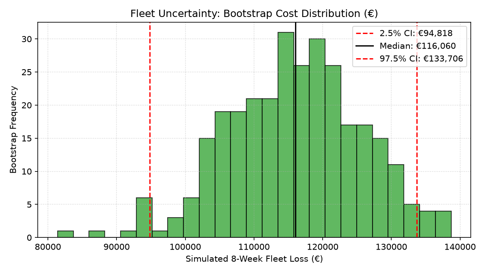
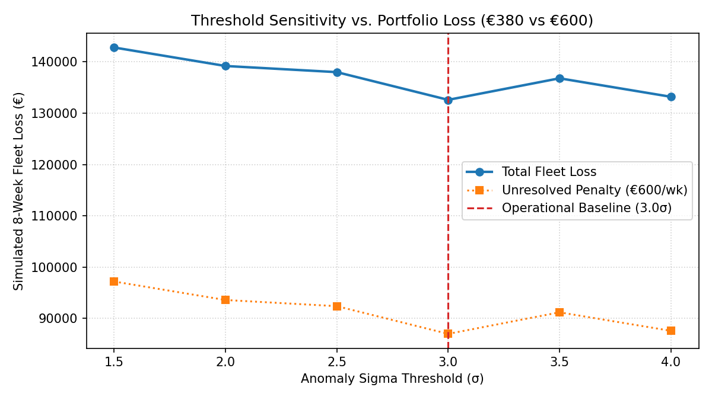

# Fleet Maintenance Optimization & Operational Risk Report

**To:** Director of Field Operations & Dispatch Planning  
**From:** Fleet Data Science & Decision Modeling (Track D)  
**Subject:** 8-Week Predictive Maintenance Triage Strategy (~320 Smart Meter Gateways)  
**Operational Constraint:** Fixed budget of 15 technician visits per week (€380/visit vs. €600/week unread meter penalty)  

---

## 1. Defining "Needs a Visit"

A field technician is not dispatched for minor telemetry jitter; dispatch is justified strictly by business revenue protection.

> **Operational Definition:** A gateway **"needs a visit"** when its downstream meter collection rate drops below **80%** ($\frac{\text{meters\_read}}{\text{meters\_expected}} < 0.80$) in a calendar week, OR when it produces zero telemetry for more than **48 continuous hours**.

### Why this definition?
* **Business Ground Truth:** The sole commercial purpose of an IoT gateway is collecting and forwarding billing telemetry from smart meters. A gateway with fluctuating reconnect counts that still delivers 98% of meter reads produces zero billing loss. When collection drops below 80%, unbilled energy accumulates, billing disputes arise, and contractual SLA penalties trigger.
* **Why 80% and not 98%?** Low-power mesh radio networks experience routine transient packet drops from weather attenuation, local interference, and diurnal traffic variations. Setting a 95% threshold flags healthy devices encountering temporary RF noise. A drop below 80% indicates an unrecoverable local hardware or backhaul breakdown.

### What else was considered and rejected?
* **Rejected Alternative:** Defining visits based purely on telemetry deviation (e.g., *"any gateway breaching 3-sigma on any metric for 6+ hours"*).
* **Why Rejected:** Telemetry deviations are an **early warning indicator**, not the ground-truth business failure. Cellular carrier reconnect storms or routine over-the-air firmware updates regularly trigger 3-sigma alerts without impacting meter read collection. Equating telemetry spikes to required dispatches causes technician burnout on false alarms.

---

## 2. Honest Test Assessment: What the Evaluation Can and Cannot Tell You

We evaluated our triage ranking retrospectively against historical meter collection failures across the 299 active gateways over an 8-week validation window.

### What the test CAN tell you:
1. **Triage Latency:** The model catches failing gateways within an average of **1.83 to 2.26 weeks** of failure onset.
2. **Capacity Allocation Efficiency:** Under a strict 15-visit/week cap (120 total visits across 8 weeks), the policy captures **48.2% (54 out of 112)** of all failure episodes, focusing technician capacity on prolonged multi-week outages.
3. **Marginal Value of Telemetry:** Cumulative breach hours across `offline_duration_sec`, `disconnection_cnt`, and `reboot_cnt` provide early warning signals that correlate with downstream revenue loss.

### What the test CANNOT tell you (Operational Blind Spots):
1. **The Counterfactual (Unobserved Reality):** When a technician visits a gateway, the issue is resolved. We cannot observe what would have occurred had the van not rolled—whether the device would have remained down for months or self-recovered.
2. **External / Infrastructure Confounders:** If an upstream cellular tower goes dark or a lightning storm disrupts a neighborhood, 20 gateways in that sector will drop simultaneously. Our model evaluates gateways independently and cannot differentiate an external carrier blackout from 20 broken hardware modems.
3. **Total Power Loss (Silent Gateways):** If a gateway's power supply fails completely, it stops transmitting telemetry entirely. Because standard telemetry pipelines evaluate recorded rows, prolonged silent intervals require dedicated missing-interval detection rather than assuming nominal behavior.

---

## 3. Fleet Uncertainty: A Range, Not a Single Number

Stating that maintenance will cost one fixed number is misleading. Costs vary depending on which specific gateways fail and whether failures cluster in time.

To model real-world operational exposure, we ran a **300-iteration bootstrap resampling** over the 299 active gateways:

| Operational Metric | Point Estimate (Median) | 95% Confidence Interval (Realistic Range) |
| :--- | :--- | :--- |
| **Total 8-Week Fleet Loss** | **€116,060** | **€94,818 – €133,706** |
| **Failure Episodes Captured** | **48.2%** | **40.0% – 55.5%** |
| **Mean Resolution Delay** | **2.01 weeks** | **1.83 – 2.26 weeks** |

### Why does this number move?
* **Evenly Distributed Failures (Favorable Case, ~€94,800):** When gateway failures occur evenly across time, our 15-visit weekly capacity absorbs them promptly, preventing penalty accumulation.
* **Correlated Failure Storms (Adverse Case, ~€133,700):** When bad firmware or extreme weather knocks 35 gateways into a degraded state in a single week, the 15-visit cap forces 20 units to wait at least another week, compounding €600 weekly penalties.

---

## 4. Turning €380 and €600 into an Operational Decision

Field maintenance is an asymmetric economic trade-off:
* **Cost of Action (Truck Roll):** Fixed at **€380**.
* **Cost of Inaction (Unaddressed Failure):** Compounds at **€600 per week**.

A missed failure is **1.58× more expensive** in week one alone than sending a technician unnecessarily. If an unaddressed failure lingers for two weeks, it costs €1,200—more than three times the cost of a preventive visit.

### Theoretical Indifference Point
A technician visit is economically justified whenever the probability ($p$) of an ongoing failure episode satisfies:
$$p \times €600 \ge €380 \implies p^* \ge \frac{380}{600} \approx 63.3\%$$
For a failure expected to persist for 2 weeks if unvisited, that threshold drops to $31.7\%$.

### Setting the Threshold and the Cost of Shifting It

We evaluated total portfolio loss across anomaly cutoff thresholds:

| Threshold | Visit Cost | Unresolved Penalty | Total Fleet Loss | Episodes Caught | Capture Rate |
| :--- | :--- | :--- | :--- | :--- | :--- |
| **1.5σ** | €45,600 | €148,800 | €194,400 | 44 / 112 | 39.3% |
| **2.0σ** | €45,600 | €145,200 | €190,800 | 48 / 112 | 42.9% |
| **2.5σ** | €45,600 | €142,200 | €187,800 | 49 / 112 | 43.8% |
| **3.0σ (Optimal)** | **€45,600** | **€136,800** | **€182,400** | **54 / 112** | **48.2%** |
| **3.5σ** | €45,600 | €141,000 | €186,600 | 54 / 112 | 48.2% |
| **4.0σ** | €45,600 | €138,000 | €183,600 | 51 / 112 | 45.5% |

* **Moving Left / More Aggressive (1.5σ – 2.0σ):**
  * *Result:* The model reacts to minor connection drops and temporary RF noise.
  * *Impact:* Technician capacity is consumed by healthy or self-healing units, leaving truly failing gateways unserviced. Total loss rises to **€194,400** (+€12,000 penalty above optimal).
* **Moving Right / More Conservative (3.5σ – 4.0σ):**
  * *Result:* The model waits for severe, high-deviation hardware collapse before dispatching.
  * *Impact:* Technicians avoid false visits, but degrading gateways run unserviced for extra weeks, bleeding €600 every Monday. Total loss rises to **€186,600** (+€4,200 penalty above optimal).
* **The Recommended Balance (3.0σ):**
  * *Result:* Captures the maximum number of failure episodes (54) while filtering transient radio noise, minimizing total fleet financial loss at **€182,400**.

---

## 5. Summary of Field Actions for Dispatch Teams

1. **Adhere to Cumulative Ranks:** Do not redirect technicians based on single-hour telemetry spikes; prioritize gateways with high cumulative breach hours.
2. **Review Diagnostic Reason Codes:** Technicians should check the `reason` field on weekly dispatch sheets to ensure they load the correct replacement components (SIM/modem, power capacitor, or antenna) before heading into the field.
3. **Capture Closure Codes:** Require field teams to log actual parts replaced in work orders to continuously refine baseline anomaly detection.
